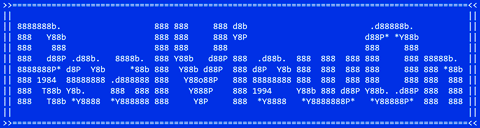

#   

**RealViewOn** enables RealView in SolidWorks versions after 2010 and fixes errors in "Enhanced graphics performance".
This tool can run directly on the target PC (recomended) or manually generate the necessary file to enable RealView on another PC.

## Key Features 🌟

- **Simplifies RealView Activation 🛠️:** Creates a `.reg` file to enable RealView in a straightforward way without needing to browse regedit.
- **FULL USER CONTROL 🖐️:** This tool **DOES NOT apply any changes** directly. It simply generates a `.reg` file for you that you can read and decide to run or not.
- **Supports Old & New Methods 🕰️:** Works with both old and new methods as needed.
- **Fixes Visual & Graphics Issues 🖼️:** Resolves many common graphical errors and visual glitches users experience when enabling enhanced graphics performance.

## Operation Modes ⚙️

- **Smart 🤖:** Automatically detects and generates all keys.
- **Manual 📝:** Allows generating the files by requesting the missing information from the user when all required data cannot be obtained.

## Usage 📋

0. 🧑 MANUAL - [Download the latest version from Releases (exe or 7z) 📥](https://github.com/ianalexis/Real-View-On-Releases/releases).
1. 🤖 AUTO - The tool detects the installed versions of SolidWorks 🔍.
2. 📑 MANUAL - Select the SolidWorks version.
3. 🤖 AUTO - Search for the GPU used by that version of SolidWorks 🖥️.
   1. 🚧 In case no Renderer is found, the user will be prompted to select:
      1. 🔍 Renderers found in the registry.
      2. 🖥️ Display Adapters found in the Device Manager.
      3. ✍️ Manually enter the GPU model.
         1. 📝 Go to the Device Manager and search for the GPU under Display Adapters.
         2. 💻 Open the GPU properties and copy the name of the device under the Details tab.
         3. ⌨️ Enter the device name into the program and press Enter.
4. 🤖 AUTO - A custom `.reg` file will be generated📝.
5. ✨ MANUAL - Execution of the `.reg` file.
   1. 🕵️ OPTIONAL - Review (with any text editor) the `.reg` file.
   2. 🚀 MANUAL - Execute the `.reg` file by double clicking on it.

## Solutions if something does not work 👩‍🔧🖥️
In case you find errors modify the `dword` values of the file with the examples for your brand to commented in the file.

### RealView does not work
Modify the `dword` values of GL2Shaders.

### Sketchs and visual errors
Modify the `dword` values of the mark.

## Contribute 🤝

We welcome any feedback regarding the functionality of the tool, whether it works or not.
If needed, we are happy to assist you , not only to ensure proper usage but also to identify potential areas for improvement.

If you needed to change the values, please share:

- **Values:** `dword` values and changes in the `.reg` file.
- **Renderer:** GPU
- **SolidWorks version:** SW versions you want to enable RealView on.

## Compatibility 🖥️

- **SolidWorks:** Versions after 2010.
- **GPU Brand:**
  - 🟢Nvidia ⭐⭐⭐
  - 🔴AMD ⭐⭐
  - 🔵Intel ⭐⭐

- *Reliability*
  - ⭐⭐⭐⭐⭐: [GPU Microarchitectures tested > 3] && [SW versions tested per generation > 2]
  - ⭐⭐⭐⭐: [GPU Microarchitectures tested > 2] && [SW versions tested per generation > 2]
  - ⭐⭐⭐: [GPUs tested > 1] && [SW versions tested > 1]
  - ⭐⭐: [Actual GPU tested]
  - ⭐: [Theoretical testing]

## Disclaimer ⚠️

This software facilitates enabling features in SolidWorks. Use it at your own discretion and responsibility.
SolidWorks & RealView are registered trademarks of Dassault Systèmes.